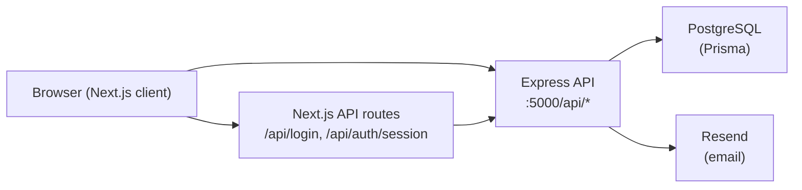

# Yohto Dashboard — Application Guide

Yohto Dashboard is an internal **workforce scheduling and job planning tool** for a cleaning service ("Yohto"). Admins schedule employee work across a monthly calendar grid and maintain a detailed weekly job showcase. Employees self-register, get approved by an admin, and then view their assignments.

The project is a monorepo-style repository with two independent apps:

- **`client/`** — Next.js 16 (App Router) frontend
- **`server/`** — Express 5 REST API backed by PostgreSQL (Prisma)

There is **no root `package.json`**; each app is installed and run separately.

---

## Table of Contents

1. [Architecture](#architecture)
2. [Tech Stack](#tech-stack)
3. [Repository Structure](#repository-structure)
4. [The Server](#the-server)
5. [The Client](#the-client)
6. [Features Overview](#features-overview)
7. [Authentication & User Lifecycle](#authentication--user-lifecycle)
8. [Environment Variables](#environment-variables)
9. [Getting Started](#getting-started)
10. [API Reference](#api-reference)
11. [Deployment Notes](#deployment-notes)

---

## Architecture



**Request/auth flow:**

1. Browser submits credentials to the Next.js BFF route (`/api/login`).
2. The BFF proxies to the Express API (`/api/login`), which returns a JWT access token + refresh token.
3. The client calls `/api/auth/session` to store both tokens in **httpOnly cookies**.
4. Next.js Server Components/Actions read those cookies to call the Express API with a Bearer token, auto-refreshing the access token via the refresh token when it expires.

---

## Tech Stack

### Client

| Category | Technology |
|---|---|
| Framework | **Next.js 16** (App Router) |
| UI | **React 19**, **Tailwind CSS 4**, **shadcn/ui** (Radix UI) |
| Tables | **@tanstack/react-table 8** |
| Forms & validation | **react-hook-form**, **@hookform/resolvers**, **zod 4** |
| Rich text | **Quill 2** / **react-quill-new**, **isomorphic-dompurify** |
| Icons | **lucide-react** |
| Language | **TypeScript 5** |

### Server

| Category | Technology |
|---|---|
| Runtime | **Node.js** (CommonJS) |
| Framework | **Express 5** |
| ORM / DB | **Prisma 6** + **PostgreSQL** (`pg` driver) |
| Auth | **jsonwebtoken**, **bcrypt** |
| Email | **Resend** |
| Security | **express-rate-limit**, **cors** |
| Dev tools | **ts-node**, **nodemon**, **TypeScript** |

---

## Repository Structure

```
yohto_dashboard/
├── client/                     # Next.js frontend
│   ├── public/                 # Static assets (SVG icons)
│   ├── src/
│   │   ├── app/                # App Router (pages + BFF API routes)
│   │   │   ├── api/            # Proxy routes (login, register, auth session, password reset)
│   │   │   ├── login/, register/, pending/, forgot-password/, reset-password/
│   │   │   ├── page.tsx        # Main monthly dashboard (/)
│   │   │   └── weekly/         # Weekly showcase (/weekly)
│   │   ├── components/
│   │   │   ├── dashboard/      # Dashboard-specific UI
│   │   │   └── ui/             # shadcn/Radix UI primitives
│   │   ├── features/dashboard/ # Domain logic (server fetches, actions, utils, types)
│   │   ├── lib/                # Auth helpers, rich-text utils, cn() utility
│   │   ├── styles/             # Rich-text CSS
│   │   ├── env.ts              # Env validation/resolution
│   │   └── middleware.ts       # Auth gate for protected routes
│   ├── components.json         # shadcn/ui config
│   ├── next.config.ts
│   └── package.json
└── server/                     # Express REST API
    ├── prisma/
    │   ├── schema.prisma       # Database schema
    │   ├── seed.ts             # Admin user seeding
    │   └── migrations/         # Migration files
    └── src/
        ├── index.ts            # Entry point (loads env, starts server)
        ├── app.ts              # Express setup (CORS, JSON, route mounting)
        ├── config/             # auth, database (PrismaClient), email
        ├── constants/          # task, task-shift, weekly-task-detail enums/validation
        ├── controllers/        # HTTP handlers (thin)
        ├── middleware/         # authenticate, requireApproved, requireAdmin, rate limiters
        ├── models/             # Prisma data-access layer
        ├── routes/             # Express routers
        ├── services/           # token, password, crypto, email
        ├── types/              # AuthUser, Express Request augmentation
        └── utils/              # calendar-week math, location-url, rich-text-html, row-key
```

---

## The Server

The Express API is organized into clear layers: **routes → controllers → models/services**, with shared `config`, `constants`, and `utils`.

### Database (PostgreSQL via Prisma)

| Model | Table | Purpose |
|---|---|---|
| `User` | (default) | Accounts with `isApproved` and `isAdmin` flags |
| `Task` | `task` | Daily job assignments per employee |
| `TaskDetail` | `task_details` | Weekly showcase grid cells (keyed by `rowKey` + `columnKey`) |
| `RefreshToken` | `refresh_tokens` | Hashed refresh tokens for session rotation |
| `PasswordResetToken` | `password_reset_tokens` | Hashed one-time reset tokens |

**`Task` fields:** `date`, `shift` (`HH:mm-HH:mm`), `userId`, `companyName`, `task`, `carName`, `transportType`, `location` (must contain a valid URL).

**`TaskDetail`:** `rowKey` follows the format `2026-w18-1` (year, ISO calendar week, row suffix). Weekly column keys include: `title`, `weekdayDate`, `customer`, `pointOfBusiness`, `keysSandra`, `alarmSandra`, `instructions`, `specialEquipmentDetergent`, `maxTimeHoursInclusiveOfDriving`.

### Server Responsibilities

- User registration with an **admin-approval workflow**
- JWT + refresh-token session management (rotation on login, revocation on logout/reset)
- Password reset via email (Resend) with time-limited, hashed tokens
- Monthly task CRUD with input validation (transport type, shift format, location URL)
- Weekly showcase cell upsert with calendar-week date resolution
- Admin user-approval management
- Initial admin seeding (`npx prisma db seed`)

---

## The Client

A Next.js App Router application that doubles as a lightweight **Backend-for-Frontend (BFF)** — its `/api/*` routes proxy to the Express API and manage auth cookies.

### Pages / Routes

| Route | Purpose |
|---|---|
| `/` | Main monthly employee dashboard (`?year=&month=`) |
| `/weekly` | Weekly job showcase table (`?year=&week=`) |
| `/login` | Sign in |
| `/register` | Create account |
| `/pending` | Shown while an account awaits approval |
| `/forgot-password` | Request a reset email |
| `/reset-password` | Set a new password from an email link |

`src/middleware.ts` protects all routes except the public auth pages, redirecting unauthenticated users to `/login`.

### Client BFF API Routes

| Route | Purpose |
|---|---|
| `/api/login` | Proxies to server `/api/login` |
| `/api/register` | Proxies to server `/api/register` |
| `/api/forgot-password` | Proxies password reset request |
| `/api/reset-password` | Proxies password reset |
| `/api/auth/session` | `POST` sets httpOnly auth cookies; `DELETE` clears them |

### State Management

There is no global store (Redux/Zustand/React Query). State is handled via:

- **React `useState`/`useEffect`** in client components
- **Next.js Server Components** for initial data fetching (`features/dashboard/server.ts`)
- **Server Actions** for mutations (`features/dashboard/actions.ts`)
- **httpOnly cookies** for JWT access + refresh tokens
- **localStorage** (`yohto_user`) for client-side profile display only
- **TanStack Table** for table rendering

### Key Components

| Component | Role |
|---|---|
| `dashboard-client.tsx` | Main monthly dashboard orchestrator |
| `weekly-showcase-client.tsx` | Weekly showcase orchestrator |
| `dashboard-header.tsx` | Title, nav, admin user management, logout |
| `dashboard-data-table.tsx` | TanStack table wrapper |
| `use-dashboard-columns.tsx` | Column definitions (date, day, week, per-user cells) |
| `dashboard-task-cell.tsx` | Renders a task in a cell; click-to-edit (admin) |
| `task-dialog.tsx` | Create/edit task modal |
| `time-range-picker.tsx` | Shift time range picker |
| `weekly-task-detail-cell.tsx` / `weekly-cell-dialog.tsx` | Weekly cell render + rich-text edit |
| `dashboard-summary-footer.tsx` | Monthly/weekly hour totals |
| `rich-text-editor.tsx` / `rich-text-content.tsx` | Quill editor + sanitized HTML display |

---

## Features Overview

### 1. Monthly Dashboard (`/`)

- Grid of **days of the month × approved team members**.
- Admins create/edit a task per user/day: company name, task description, car name, transport type, location (rich text with a map URL), and shift time range.
- Summary footer computes **monthly hours per user, weekly averages, and daily totals**.
- Month navigation via URL search params.

> Note: the availability column in the monthly grid currently uses **random mock data** and is not persisted to the backend.

### 2. Weekly Showcase (`/weekly`)

- Detailed job-planning table with 9 columns (customer, point of business, keys/alarm details, instructions, special equipment/detergent, max hours, etc.).
- Admins edit cells (rich text) and add rows.
- Persisted as `TaskDetail` records keyed by calendar week, separate from the daily task grid.
- Week navigation via URL search params.

### 3. Admin Features

- Approve/reject users from the header dropdown.
- Create/edit tasks on the monthly grid.
- Edit weekly showcase cells and add rows.

---

## Authentication & User Lifecycle

1. **Register** → account created with `isApproved: false` → user is sent to `/pending`.
2. **Admin approves** the user via the header dropdown (`PATCH /api/users/:id/approval`).
3. **Login** → server returns a JWT access token (default 15m) + refresh token (default 30d); client stores them in httpOnly cookies.
4. **Protected access** → `authenticate` + `requireApproved` middleware guard the API; `requireAdmin` guards approval management.
5. **Forgot/Reset password** → Resend emails a time-limited token; resetting invalidates all refresh tokens.

**Security measures:** bcrypt password hashing (12 rounds), SHA-256-hashed refresh & reset tokens stored in DB, rate limiting (20 req/15min on auth, 5 req/hour on password reset), and CORS restricted to `CLIENT_ORIGIN`.

---

## Environment Variables

### Server (`server/.env`)

| Variable | Purpose |
|---|---|
| `DATABASE_URL` | PostgreSQL connection string |
| `PORT` | Server port (default `5000`) |
| `JWT_SECRET` | JWT signing secret (min 32 chars) |
| `JWT_EXPIRES_IN` | Access token lifetime (default `15m`) |
| `JWT_REFRESH_EXPIRES_IN` | Refresh token JWT expiry (default `30d`) |
| `JWT_REFRESH_TTL_SECONDS` | Refresh token DB TTL (default `2592000`) |
| `CLIENT_ORIGIN` | CORS allowed origin |
| `TRUST_PROXY` | Reverse proxy hops for rate limiting |
| `CLIENT_BASE_URL` | Client URL for email links (falls back to `CLIENT_ORIGIN`) |
| `PASSWORD_RESET_TTL_SECONDS` | Reset token lifetime (default `1800`) |
| `RESEND_API_KEY` | Resend API key for transactional email |
| `EMAIL_FROM` | Verified sender address |
| `ADMIN_EMAIL` | Seed script admin email |
| `ADMIN_PASSWORD` | Seed script admin password |

### Client (`client/.env.local`)

| Variable | Purpose |
|---|---|
| `NEXT_PUBLIC_API_BASE_URL` | Public API URL for browser-side requests (required in production) |
| `API_BASE_URL` | Optional private URL for Server Components/Actions (e.g. Docker internal network) |

> Dev default: if unset, the client falls back to `http://localhost:5000` for API calls.

---

## Getting Started

### Prerequisites

- Node.js
- A PostgreSQL database
- Copy the example env files:
  - `server/.env.example` → `server/.env`
  - `client/.env.local.example` → `client/.env.local`

### Server

```bash
cd server
npm install                 # postinstall runs `prisma generate`
npx prisma migrate deploy   # apply migrations
npx prisma db seed          # create the admin user (needs ADMIN_EMAIL/PASSWORD)
npm run dev                 # nodemon + ts-node on port 5000
```

| Script | Command | Description |
|---|---|---|
| `dev` | `nodemon --watch src --ext ts --exec ts-node ./src/index.ts` | Dev with hot reload |
| `start` | `ts-node ./src/index.ts` | Run once (dev) |
| `build` | `tsc` | Compile to `dist/` |
| `start:prod` | `node dist/index.js` | Production |
| `migrate` | `prisma migrate deploy` | Apply DB migrations |

### Client

```bash
cd client
npm install
npm run dev                 # Next.js on http://localhost:3000
```

| Script | Command | Description |
|---|---|---|
| `dev` | `next dev --hostname 0.0.0.0 --port 3000` | Dev server |
| `build` | `next build` | Production build |
| `start` | `next start` | Production server |
| `lint` | `eslint` | Lint |
| `type-check` | `tsc --noEmit` | TypeScript check |

---

## API Reference

All endpoints are prefixed with `/api`.

| Method | Endpoint | Auth | Description |
|---|---|---|---|
| `POST` | `/api/register` | Public (rate-limited) | Register a new user (`isApproved: false`) |
| `POST` | `/api/login` | Public (rate-limited) | Login; returns JWT + refresh token if approved |
| `POST` | `/api/refresh` | Public | Refresh access token |
| `POST` | `/api/logout` | Public | Revoke refresh token |
| `POST` | `/api/forgot-password` | Public (rate-limited) | Send password reset email |
| `POST` | `/api/reset-password` | Public (rate-limited) | Reset password with token |
| `GET` | `/api/auth/me` | Bearer JWT | Current user profile |
| `GET` | `/api/users` | Approved user | List users (admin: all; others must pass `?approved=`) |
| `PATCH` | `/api/users/:id/approval` | Admin | Toggle user approval |
| `GET` | `/api/tasks?year=&month=` | Approved user | Tasks for a calendar month |
| `POST` | `/api/tasks` | Approved user | Create a task |
| `PATCH` | `/api/tasks/:id` | Approved user | Update a task |
| `GET` | `/api/task-details?year=&week=` | Approved user | Weekly showcase cells for a week |
| `GET` | `/api/task-details?year=&minWeek=&maxWeek=` | Approved user | Cells for a week range |
| `POST` | `/api/task-details/upsert` | Approved user | Upsert a weekly showcase cell |

---

## Deployment Notes

- The client is intended for **Vercel** (deployment references appear in the code, e.g. `yohto-cleaning-service.vercel.app`).
- The Express API is deployed separately; set `CLIENT_ORIGIN` to the deployed client URL and `NEXT_PUBLIC_API_BASE_URL` to the deployed API URL.
- Ensure `JWT_SECRET` is a strong (32+ char) secret in production, configure `TRUST_PROXY` appropriately behind a reverse proxy, and verify the `EMAIL_FROM` sender domain in Resend.
- Run `prisma migrate deploy` against the production database and seed the initial admin user via `ADMIN_EMAIL` / `ADMIN_PASSWORD`.
