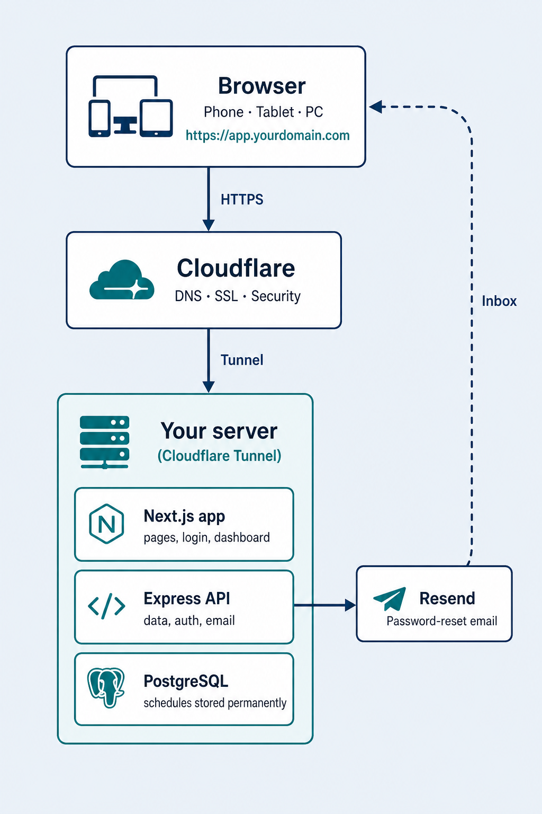
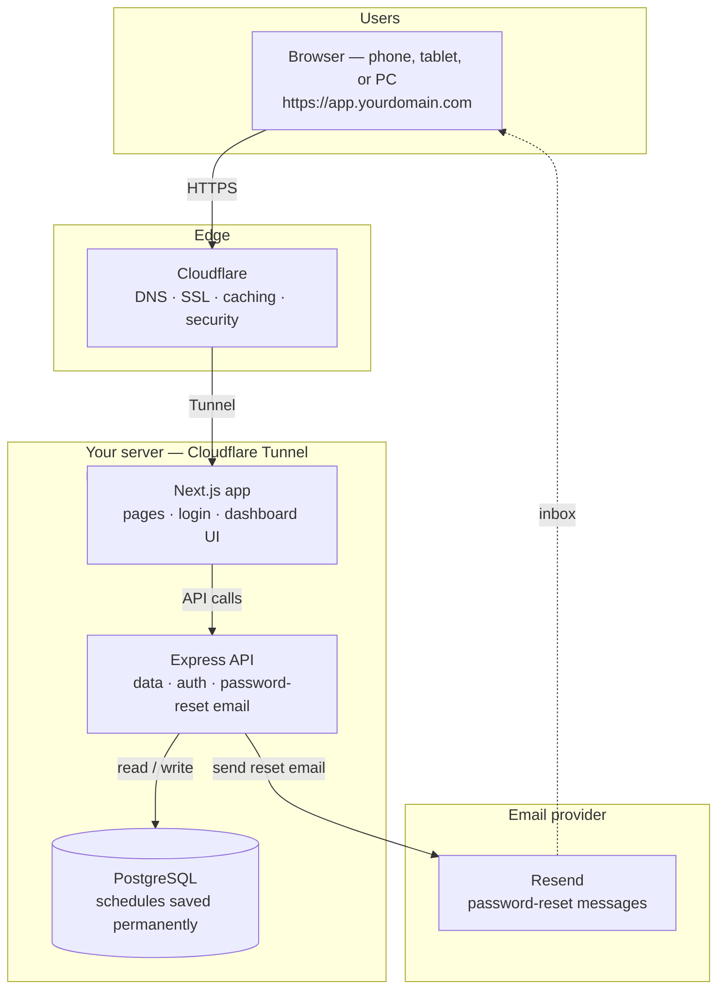

# Extra Team Dashboard — Product Overview

> **Shorter formats:** [Client overview](./CLIENT-OVERVIEW.md) · [Client benefits](./CLIENT-BENEFITS.md) · [One-pager](./PRODUCT-ONE-PAGER.md) · [Sales & pricing](./PRODUCT-SALES.md)

**Extra Team Dashboard** is a web application for cleaning and field-service teams who need a clear, shared view of **who works when**, **what jobs are planned**, and **detailed weekly job information** — all in one secure place.

Production example: **https://app.pcsmonthlypla.online**

---

## Who is it for?

| Role | How they use the app |
|------|----------------------|
| **Team members** | View their schedule, open **My work** for personal job cards, check weekly site details, reset their own password by email |
| **Administrators** | Plan the month, edit weekly sheets, review all staff cards under **Staffs**, monitor hours on **Staff KPI**, approve users, manage columns |
| **Operations / office** | Track hours per person, per day, and per week from automatic summaries and the Staff KPI chart |

Built for teams like **Extra Team** (cleaning services) but flexible enough for any business that schedules people by day and needs a weekly planning grid.

---

## How it works

Traffic flow: **browser → Cloudflare → tunnel → Next.js + API → PostgreSQL**. Password-reset mail goes **API → Resend → user inbox**.

### Typical day for a team member

1. Open the app and **log in**.
2. On the **Main dashboard**, find their name column and scroll to today’s date.
3. Or open **My work** in the sidebar to see only their jobs as cards.
4. Read the task: company, description, car, status, shift times, location link.
5. On **Weekly showcase**, open the current calendar week for detailed site instructions (keys, alarm, equipment, max hours, etc.).

### Typical day for an admin

1. Log in and open the **Main dashboard** for the month.
2. Click **+** in a cell to assign or update a job for a team member on a specific day.
3. Open **Weekly showcase**, add rows, fill cells, or **Manage columns** to show/hide or add custom fields.
4. Open **Staffs** to review everyone’s job cards for the month.
5. Open **Staff KPI** to compare monthly hours per person against the working limit.
6. Approve new registrations from the sidebar **Manage users** panel.

All changes are **saved to the database immediately** and visible to the team after refresh.

---

## Features

### Main dashboard (monthly schedule)

- **Calendar grid** — every day of the month × each approved team member.
- **Task details per cell:**
  - Shift time range (start–end)
  - Company name
  - Task description (rich text)
  - Car / vehicle
  - Status (Start from PCS Driving, Start from Customer, Paid Holiday, Start from PCS, Vacation, Sick leave, Unpaid off) with colour indicators
  - Location (text or clickable map link)
- **Automatic hour summaries:**
  - Total hours per person for the month
  - Weekly average per person
  - Daily total hours (all staff)
- **Month navigation** — move between past and future months.
- **Today highlighted** — the current day row stands out for everyone.
- **Sticky date columns** on mobile — date, day, and week stay visible while scrolling.
- **Your name highlighted** in the header so you can find your column quickly.

### Weekly showcase (detailed job planning)

- **Week-by-week table** with rich job information, including:
  - Title
  - Weekday / date (with assigned team members)
  - Customer
  - Point of business
  - Keys
  - Alarm
  - Instructions
  - Special equipment / detergent
  - Max time (hours, inclusive of driving)
- **Custom columns** — admins can add fields (e.g. “Working hours”, parking notes).
- **Show / hide columns** — hide built-in columns without losing data; restore anytime.
- **Edit column labels** and header colours for important columns.
- **Multiple rows per week** — add a row when you have more than one job line.
- **Rich text** in cells — formatting, links, file-style link chips.
- **Week navigation** — browse any calendar week in any year.

### My work / Staffs (personal job cards)

Sidebar page at `/my-tasks`. The label and content change by role:

| | **Team member (My work)** | **Administrator (Staffs)** |
|---|---------------------------|----------------------------|
| **Sidebar label** | My work | Staffs |
| **Page title** | My work | Staffs |
| **What they see** | Only **their own** jobs for the selected month | **All team members’** jobs for the selected month |
| **Layout** | Card grid | Cards **grouped by person**, with name on each card |
| **Purpose** | Quick personal view on phone | Review everyone’s assignments at a glance |

**Each card shows:**
- Date and shift time
- Status type
- Company name
- Task description
- Car / vehicle
- Location (text or map link)
- Light highlight when the card is for **today**

**Also:**
- Same **month navigation** as the main dashboard (previous / next / jump to current month)
- Empty state if there are no assignments that month
- Read-only for staff — editing stays on the Main dashboard (admins)
- **My work** cards — border colour matches **status type** (see colour legend on the page)

### Staff KPI (admin hours chart)

Sidebar page at `/kpi` — **administrators only** (non-admins are redirected).

- **Bar chart** of total hours worked per approved team member for the selected month.
- **Working limit** — editable number input (default **170 h / person**); the chart’s red limit line, remaining hours, and % of limit update from that value.
- Bars under the limit are highlighted in sky blue; bars **over the limit** in pink.
- Summary cards: total hours, working limit, staff with hours, count over limit.
- Table under the chart: hours, remaining (of limit), and % of limit per person.
- Same **month navigation** as the main dashboard.

### User & security

- **Self-registration** — new staff sign up; admin approves before access.
- **Secure login** — passwords hashed; sessions use short-lived tokens + refresh tokens in httpOnly cookies.
- **Password reset by email (active)** — user clicks **Forgot password** on the login page, enters their registered email, and receives a reset link at that address (via Resend). They open the link, set a new password, and can log in again. Requires a **verified sending domain** and correct `EMAIL_FROM` on the server (see [Email domain for password reset](#email-domain-for-password-reset)).
- **Role-based access:**
  - **Admin** — full edit, user management, column management, **Staffs** cards, and **Staff KPI**.
  - **Approved user** — view schedules and **My work** cards; admins edit on their behalf.
- **Rate limiting** on login, registration, and password-reset requests to reduce abuse.

### User experience

- **Light and dark mode** — switch in the sidebar; works on mobile.
- **Responsive layout** — usable on phone, tablet, and desktop.
- **Sidebar navigation** — Main dashboard, Weekly showcase, My work / Staffs, and **Staff KPI** (admins).
- **Branded header** — Extra Team logo and title.

### Administration

- **Approve / unapprove users** from the sidebar.
- **Delete unapproved users** when needed.
- **Pending approval badge** — admins see how many users are waiting.
- **Polling** — user list updates periodically for admins.

---

## Flexibility for users and administrators

| Need | How the app adapts |
|------|---------------------|
| Different job fields each week | Add **custom columns** on Weekly showcase |
| Too many columns on screen | **Hide** columns; data stays in the database |
| Rename a column for your team | **Edit header label** (e.g. “Max time (h)” → “Working hours”) |
| Highlight important columns | **Header styles** (default, keys, alarm colours) |
| More than one job line per week | **Add row** on Weekly showcase |
| Staff want a simple personal view | Use **My work** cards instead of the full grid |
| Admin needs all staff jobs in one place | Open **Staffs** — cards grouped by person |
| Admin needs hours vs monthly target | Open **Staff KPI** — bar chart + adjustable working limit |
| Staff forgot password | **Forgot password** sends a reset link to their registered email |
| Different assignment statuses | Seven built-in status types with visual indicators |
| Location as text or map link | Enter plain address text or a URL; map icon only for links |
| Work from phone | Full mobile layout; tunnel + HTTPS; no app store install |
| Personal preference | Light / dark theme |
| Growing team | New users register; admin approves — no manual account creation required |
| Multi-month planning | Navigate months on main dashboard, My work / Staffs, and Staff KPI; weeks on weekly view |

---

## Step-by-step guide

### For new team members

1. Go to the app URL (e.g. `https://app.pcsmonthlypla.online`).
2. Click **Register** and fill in name, email, and password.
3. Wait for **administrator approval** (you’ll see a pending message until approved).
4. After approval, **log in**.
5. Open **Main dashboard** — find your name in the header row.
6. Scroll to the day you need and read your assignment.
7. Open **My work** from the sidebar for your personal job cards.
8. Open **Weekly showcase** from the sidebar for detailed weekly instructions.

### For administrators — first-time setup

1. Deploy the application on your server (see `deploy/SERVER-SETUP.md`).
2. Set environment variables (database, JWT secret, email, domain).
3. Run database migrations and seed the first admin user.
4. Start services: API, client, Cloudflare Tunnel.
5. Log in as admin and verify Main dashboard, Weekly showcase, **Staffs**, and **Staff KPI** load.
6. Confirm **Forgot password** delivers mail to a real user inbox (verified domain + `EMAIL_FROM`).

### For administrators — daily use

**Assign a job (monthly grid)**

1. Main dashboard → select month.
2. Click **+** in the cell (team member × day).
3. Set shift time, company, task, car, status, location.
4. Save — the cell updates for everyone.

**Edit weekly job sheet**

1. Sidebar → **Weekly showcase**.
2. Select the correct **week** with arrows.
3. Click **+** in a cell or use the pencil icon on filled cells.
4. Save — data is stored per week and row.

**Manage columns (weekly)**

1. Weekly showcase → **Manage columns**.
2. Hide/show built-in columns, add a custom column, or restore hidden ones.
3. Click a column header to **rename** or change style.

**Review all staff cards**

1. Sidebar → **Staffs**.
2. Select the month.
3. Browse cards grouped by team member (name appears on each card).

**Review hours (Staff KPI)**

1. Sidebar → **Staff KPI**.
2. Select the month.
3. Optionally change **Working limit** (hours per person) — the red line and over-limit colours update.
4. Compare bars and the table (hours, remaining, % of limit).

**Approve a new user**

1. Sidebar → **Manage users** (badge shows pending count).
2. Toggle approval **on** for the new team member.
3. They can log in on their next visit.

### For team members — password reset

1. Login page → **Forgot password**.
2. Enter the **email used at registration**.
3. Open the reset link from the inbox (check spam if needed).
4. Choose a new password and submit.
5. Log in with the new password.

### For administrators — monthly review

1. Main dashboard → scroll to the **summary footer**.
2. Review **SUM h/month** and **AVERAGE h/week** per person.
3. Review **Tot. hours** per day on the right column.
4. Open **Staff KPI** for a visual hours comparison against the working limit.

---

## Cost

This product is **self-hosted software** — there is no built-in subscription or per-seat fee inside the application. Your costs depend on how you run it:

| Item | Typical cost | Notes |
|------|----------------|-------|
| **Software license** | Project-specific | Contact your provider / internal IT |
| **Server (VPS or PC)** | ~€5–40 / month | Small team; e.g. Ubuntu on a VPS or office PC |
| **Domain name** | ~€10–15 / year | App URL + email sending (e.g. `pcsmonthlypla.online`) |
| **Cloudflare** | Free tier often sufficient | DNS, SSL, Tunnel, basic security |
| **Email (password reset)** | Free tier → paid | Resend (or similar). **Active:** reset links are emailed to the user’s registered address. Needs a **verified sending domain** — e.g. `noreply@app.pcsmonthlypla.online`. Add SPF/DKIM in DNS. Sandbox sender is only for testing to your own Resend login email. |
| **PostgreSQL** | Included on server | Runs locally on the same machine |
| **Support & maintenance** | Optional | Updates, backups, monitoring |

**No hidden per-user charges** in the app itself. You control:

- How many users can register (admin approval gate).
- How long you keep the server running.
- Whether you add paid email, backup, or monitoring services.

### Email domain for password reset

Password reset is **enabled**: the API sends a time-limited reset link to the **email the user registered with**. Delivery needs a domain you control, verified with the email provider (e.g. Resend):

1. Own a domain (often the same as the app host: `app.pcsmonthlypla.online` / `yourcompany.com`).
2. In Resend → **Domains**, add that domain (free plan = **1 domain**).
3. Copy the DNS records Resend shows into Cloudflare (SPF / DKIM; use DNS-only / grey cloud).
4. Wait until Resend shows **Verified**.
5. Set on the server: `EMAIL_FROM="Your Company <noreply@app.yourdomain.com>"` (must match the verified domain) and restart the API.
6. Test: login → **Forgot password** → confirm the message arrives in the user’s inbox.

Until verification is done, the Resend sandbox (`onboarding@resend.dev`) can only deliver to **your Resend account email**, not to the whole team.

### What you get for that investment

- Unlimited approved team members (within server capacity).
- Unlimited months and weeks of schedule history (database storage).
- Custom weekly columns without extra modules.
- Secure HTTPS access from anywhere (with Cloudflare Tunnel).

---

## Technical summary (for IT / decision makers)

| Aspect | Detail |
|--------|--------|
| Type | Web application (browser-based) |
| Frontend | Next.js 16, React 19 |
| Backend | Express 5, PostgreSQL, Prisma |
| Auth | JWT + refresh tokens, bcrypt passwords |
| Hosting | Self-hosted; Cloudflare Tunnel recommended |
| Mobile | Responsive web — no native app required |
| Data | Stored in your PostgreSQL database on your server |
| Availability | Depends on your server and tunnel uptime |

---

## Support & documentation

| Document | Audience |
|----------|----------|
| **CLIENT-OVERVIEW.md** | Client sales pack — features + light tech |
| **CLIENT-BENEFITS.md** | How the client benefits — pitch, roles, vs spreadsheet |
| **PRODUCT-ONE-PAGER.md** | Quick overview, email attachment |
| **PRODUCT-SALES.md** | Sales brochure, pricing, support packages |
| **PRODUCT.md** (this file) | Customers, managers, new users |
| **DOCUMENTATION.md** | Developers, technical staff |
| **deploy/SERVER-SETUP.md** | Server administrators |
| **deploy/SECURITY-LOGGING.md** | Security and audit |

---

## Quick FAQ

**Do I need to install an app on my phone?**  
No. Use Chrome, Safari, or any modern browser.

**Can I see last month’s schedule?**  
Yes. Use month navigation on the main dashboard.

**What if I forget my password?**  
Use **Forgot password** on the login page. Enter your registered email — the app emails you a reset link at that address. Open the link, set a new password, then log in.

**Can team members edit the schedule?**  
Only **administrators** create and edit tasks. Team members view assignments on the Main dashboard and **My work**.

**What is Staff KPI?**  
An **admin-only** page with a monthly hours bar chart per staff member, an adjustable working-limit line (default 170 h), and a table of remaining hours / % of limit.

**What is My work vs Staffs?**  
Same page, different role: team members see only their cards (**My work**); admins see everyone’s cards grouped by person (**Staffs**).

**Can we add our own column names?**  
Yes. Admins use **Manage columns** on Weekly showcase and can add custom columns.

**Is our data on someone else’s cloud?**  
The database runs on **your server**. Cloudflare handles public access and security in front of it; you control the machine and backups.

---

*Extra Team Dashboard — workforce scheduling and weekly job planning for field teams.*
